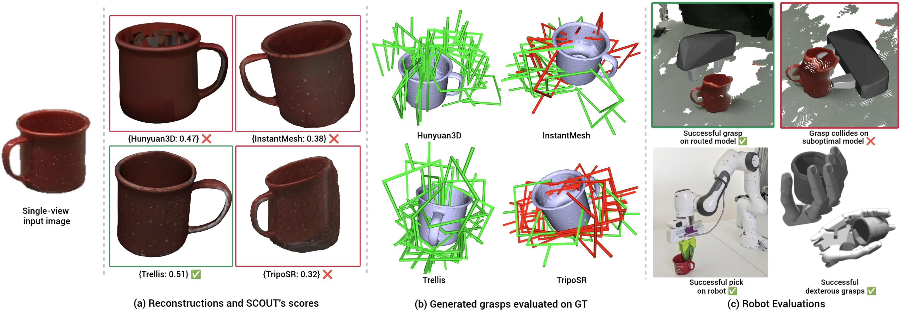

# SCOUT

### [📝 Paper](https://scout-model-routing.github.io/static/scout-model-routing.pdf) | [🌐 Project Website](https://scout-model-routing.github.io)

**SCOUT** (**S**core-**C**onditioned **O**ptimal **U**tility **T**argeting) is a *routing framework that selects the best 3D reconstruction model for a given input image*, balancing reconstruction quality against user-specified cost constraints (latency, memory, etc.) for robotic manipulation.



Please read the official paper for a detailed overview of our work.
> **Which Reconstruction Model Should a Robot Use? Routing Image-to-3D Models for Cost-Aware Robotic Manipulation**<br>
> Akash Anand, Aditya Agarwal, Leslie Pack Kaelbling<br>
> [arXiv:XXXX.XXXXX](https://arxiv.org/abs/XXXX.XXXXX)

-----

**Table of Contents**

- [🛠️ Installation](#-installation)
- [📦 Data](#-data)
- [🚀 Usage](#-usage)
  - [Running Experiments](#running-experiments)
  - [Running Individual Scripts](#running-individual-scripts)
- [📊 Visualizations](#-visualizations)
- [🧪 Methods](#-methods)
- [📜 Cite Us](#-cite-us)

## 🛠️ Installation

#### 1. Setup conda environment
```bash
conda create -n scout python=3.10 -y
conda activate scout
```

#### 2. Install PyTorch with CUDA 12.1
```bash
pip install torch==2.5.1 --index-url https://download.pytorch.org/whl/cu121
```

#### 3. Install remaining dependencies
```bash
git clone https://github.com/SCOUT-Routing/SCOUT.git
cd SCOUT
pip install -r requirements.txt
```

## 📦 Data

We provide a script to download the dataset files from [HuggingFace](https://huggingface.co/datasets/Akashk1010/scout-routing-data):
```bash
bash download_data.sh
```

This will place the following files in `data/`:

| File | Dataset | Metric |
|------|---------|--------|
| `gso_data_huny_inst_trel_trip_dcd.npz` | GSO | DCD |
| `model_categories_real_gso.csv` | GSO | — |
| `ycb_data_huny_inst_trip_trel_dcd.npz` | YCB | DCD |
| `ycb_data_huny_inst_trip_trel_cdl1.npz` | YCB | CDL1 |
| `ycb_data_huny_inst_trip_trel_cdl2.npz` | YCB | CDL2 |
| `ycb_data_huny_inst_trip_trel_iou.npz` | YCB | IoU |
| `ycb_data_huny_inst_trip_trel_emd.npz` | YCB | EMD |
| `ycb_data_huny_inst_trip_trel_geo.npz` | YCB | Geo |
| `ycb_data_huny_inst_trip_trel_struct.npz` | YCB | Structural |
| `model_categories_real_ycb.csv` | YCB | — |

Each `.npz` file contains paired image embeddings and per-model reconstruction scores.

## 🚀 Usage

All run scripts are executed from the **project root**. Each run script automatically sets the `SCOUT_EXPERIMENT` environment variable to select the correct configuration from `scripts/utils/config.py`.

### Running Experiments

#### 1. GSO
```bash
python scripts/run_scripts_gso.py
```

#### 2. YCB
```bash
python scripts/run_all_ycb.py
```

#### 3. Deferral Curves/AIQ
```bash
python scripts/run_scripts_deferral.py
```

#### 4. Scalability
```bash
python scripts/run_scripts_many_scanners.py
```

Each script runs all methods (SCOUT, baselines) across seeds 50–199. Results are written to `results/`.

### Running Individual Scripts

You can run individual scripts directly, overriding any hyperparameters via CLI flags:
```bash
SCOUT_EXPERIMENT=gso python scripts/scout_proper.py \
    --seed 50 --folder_suffix _gso --T 1.0 --beta 0.7 --lr 1e-4 --epochs 10
```

Available flags commonly include `--T`, `--beta`, `--lr`, `--epochs`, `--batch_size`, `--hidden_dim`, `--alpha`, `--weight_decay`, and `--experiment_type`. CLI flags take precedence over the defaults in `config.py`.

Valid experiment names: `gso`, `ycb_dcd`, `ycb_cdl1`, `ycb_cdl2`, `ycb_iou`, `ycb_emd`, `ycb_geo`, `ycb_struct`.

## 📊 Visualizations

Jupyter notebooks in `visualizations/` reproduce all tables and figures:

| Notebook | Paper content |
|----------|---------------|
| `visualize_gso.ipynb` | GSO results table (Table 1) |
| `visualize_ycb_summary.ipynb` | YCB cross-metric tables (Tables 3 & 4) |
| `visualize_deferral.ipynb` | Deferral Pareto curves (Figure 3 & Table 2) |
| `visualize_flexibility.ipynb` | Scalability plot (Figure 2) |

## 🧪 Methods

| Paper name | Script |
|------------|--------|
| SCOUT | `scripts/scout_proper.py` |
| SCOUT (no decoupling) | `scripts/scout_no_decouple.py` |
| RouterDC | `scripts/baselines/routerdc_script.py` |
| MLP | `scripts/baselines/mlp_script.py` |
| MF | `scripts/baselines/mf_script.py` |
| kNN | `scripts/baselines/knn_script.py` |
| Linear Regression | `scripts/baselines/linear_regression_script.py` |
| Input-agnostic (Mean) | `scripts/baselines/mean_script.py` |
| Oracle | `scripts/baselines/oracle_script.py` |

## 📜 Cite Us

